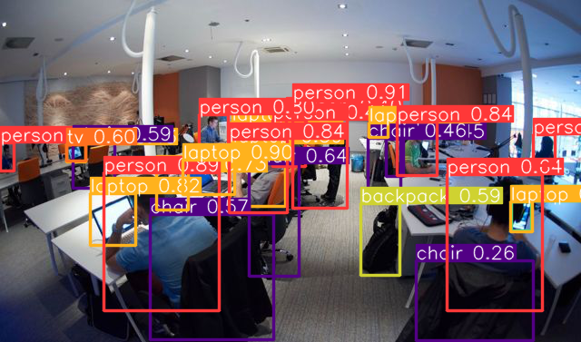

# Python-in-Java
This java class use a neural network that is written in python.
Neural network github [page](https://github.com/ayoolaolafenwa/PixelLib).

## How it works
You can see how the model works 
in more details 
[here](https://towardsdatascience.com/image-segmentation-with-six-lines-0f-code-acb870a462e8). 
My Java code send image as bytecode to NN, 
it segmentation this image and sending coordinates of entity boxes 
as JSON (people, tables and other).
### Examples 
```bash
java -jar target/PyInJavaStarter.jar src/main/resources/man-and-table.jpeg src/main/results/resultJava.json
```
Input image:


Output image:



Output JSON [here](src/main/results/json/resultJava.json)

## Installation

Use the package manager [pip](https://pip.pypa.io/en/stable/) to install python libs.

```bash
pip3 install setuptools
pip3 install protobuf==3.19.6
pip3 install tensorflow
pip3 install torch torchvision torchaudio --index-url https://download.pytorch.org/whl/cpu
pip3 install aiogram
```

## Start

```bash
mvn compile
mvn package 
java -jar target/PyInJavaStarter.jar imagePath resultPath
```
"imagePath" is the path of your image

"resultPath" is the path where the JSON will be saved